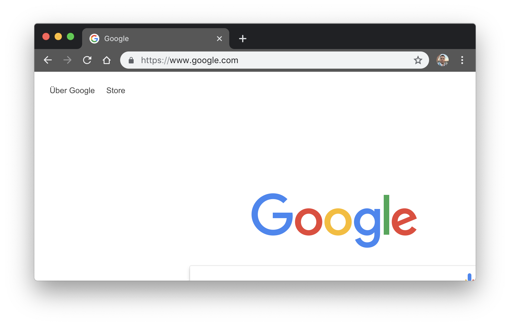
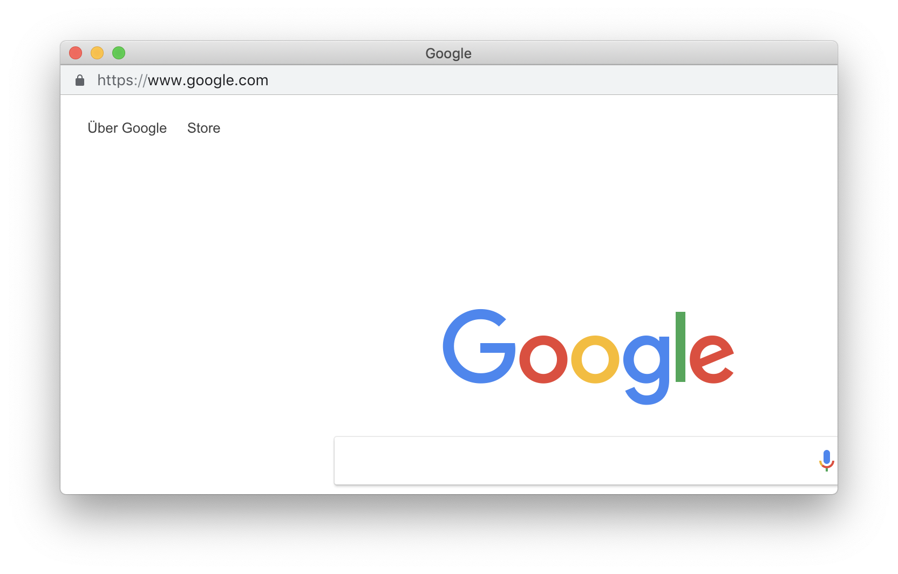

# Open with bookmarklet website in browser kiosk mode

The following Link is a Bookmarklet to open the current site at your browser in a new window with minimal clutter like chrome kiosk mode.  

Drop the following link to your Bookmarkbar and use it to open any page in new window:  
[browser-kiosk-mode](javascript:(function()%7Bwindow.open(window.location.href%2C%20'_blank'%2C%20'toolbar%3D0%2Clocation%3D0%2Cmenubar%3D0')%7D)())

## Example

Chrome browser:

Chrome popup:

## GitHub Page

([GitHub Page](https://schobner.github.io/browser-kisok-mode/))
